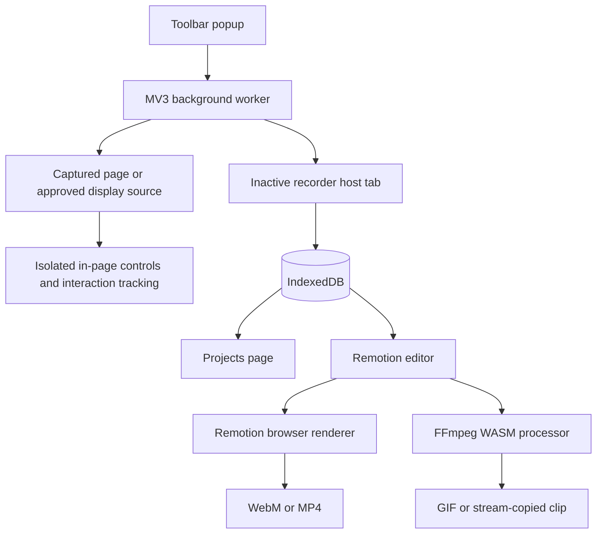

# Rio Recorder

Rio Recorder is a local-first Chromium extension for recording a browser tab, window, screen, or selected page area and turning the result into a polished video without leaving the browser.

Recordings, imported media, interaction data, and editor settings are stored in the extension's IndexedDB. Rio does not require an account or upload projects to a Rio service.

> Rio is under active development. The current implementation targets Chromium Manifest V3 and has not yet completed its cross-browser, recovery, accessibility, or release audits. See [`PLAN.md`](./PLAN.md) for the current status.

## What it can do

### Record

- Capture a browser tab, window, full display, or selected area of the current webpage.
- Include microphone and source audio when the selected source and browser support them.
- Pause, resume, and stop from compact controls attached to the originating page.
- Keep recording work in a persistent extension host instead of the short-lived toolbar popup.
- Open the editor automatically when a recording finishes.
- Start an empty project without making a recording.

Area recording uses an in-page selector, captures the chosen tab, and crops the encoded frames to the fixed viewport region. Chrome's source approval remains authoritative.

### Edit

- Non-destructive recording clips with free timeline positioning, gaps, splitting, trimming, duplication, deletion, and layer ordering.
- Multiple uploaded images, videos, and audio files with reusable project assets.
- Drag files directly onto the canvas or timeline to import and place them.
- Per-video playback speed from `0.25×` to `4×`, synchronized across timeline duration, preview, gestures, and export.
- Shift-click multi-selection and synchronized movement.
- Trackpad timeline zoom, adjustable timeline height, optional `0.5s` ruler ticks, and click-to-seek.
- Text clips with installed font selection, size, scale, weight, rotation, solid or gradient fill, and stroke.
- Uploaded audio volume plus fade-in and fade-out envelopes.

### Style

- Frame treatments including glass, liquid glass, inset, outline, and border presets.
- Sharp, rounded, and continuously curved frame shapes.
- Adjustable border width, color, opacity, corner radius, and smoothing.
- None, spread, huge, and adaptive shadows with a movable light source.
- Transparent, solid, gradient, radiant, mesh, Unsplash, and custom-image backgrounds.
- Canvas presets for common Instagram, YouTube, TikTok, Facebook, X, and LinkedIn formats, plus custom dimensions.
- Direct canvas positioning and scaling for visual media.

### Recorded gestures

For interactions Rio can observe in the originating webpage, it records pause-aware metadata for:

- Pointer movement
- Clicks and double-clicks
- Drag movement
- Scrolling

Gesture data is a separate timeline effect. Multiple gesture clips can define exactly where effects appear, including intentional gaps. Each clip has action toggles and controls for colors, sizes, animation style, trail width, duration, and opacity.

Original-quality clip downloads can carry Rio gesture data in a versioned footer. If such a video is imported into a project, its actions can be selected as a gesture source.

### Projects and export

- Dedicated project browser with previews, recording details, open, and delete actions.
- Recent-project menu in the editor.
- Full project ZIP import and export, including the source recording, editor settings, interaction metadata, and imported assets.
- Styled WebM and MP4 export through Remotion's browser renderer.
- Animated GIF export through locally packaged FFmpeg WASM.
- Output presets from `480p` through `4K`, with `15`, `24`, `30`, or `60` FPS.
- Original-quality clip extraction without re-encoding. Trimmed extraction runs in a separate processor page and mounts the source Blob through FFmpeg `WORKERFS` to avoid duplicating the full recording in editor memory.

## Install for development

### Requirements

- [Bun](https://bun.sh/)
- A current Chromium-based browser

### Setup

```sh
bun install
bun run build
```

Then load the unpacked extension:

1. Open `chrome://extensions`.
2. Enable **Developer mode**.
3. Choose **Load unpacked**.
4. Select `.output/chrome-mv3` from this repository.
5. Pin Rio Recorder to the browser toolbar.

After rebuilding, reload the extension from `chrome://extensions`. Existing editor tabs must also be refreshed to use the new bundle.

For development with WXT:

```sh
bun run dev
```

## Optional Unsplash configuration

Custom uploads and built-in backgrounds work without external configuration. Unsplash search requires a public Unsplash Access Key.

Create `.env.local`:

```dotenv
WXT_PUBLIC_UNSPLASH_ACCESS_KEY=your_public_access_key
```

Only use the public Access Key. Never place an Unsplash Secret Key in a `WXT_PUBLIC_*` variable because public build variables are embedded in inspectable extension code.

When Unsplash is used, search and download-tracking requests are sent to Unsplash, and selected images are loaded from `images.unsplash.com`.

## Commands

| Command | Purpose |
| --- | --- |
| `bun run dev` | Start the Chromium development build |
| `bun run compile` | Run TypeScript without emitting files |
| `bun run build` | Build the production Chromium extension |
| `bun run zip` | Package the Chromium extension |
| `bun run dev:firefox` | Start the experimental Firefox development build |
| `bun run build:firefox` | Build the experimental Firefox target |

Firefox scripts are present through WXT, but Firefox compatibility has not been validated and should not be treated as supported yet.

## Editor shortcuts

| Shortcut | Action |
| --- | --- |
| `Space` | Play or pause |
| `←` / `→` | Seek backward or forward one second |
| `Delete` / `Backspace` | Delete the selected timeline item |
| `Ctrl/Cmd + C` | Copy the selected item |
| `Ctrl/Cmd + V` | Paste |
| `Ctrl/Cmd + D` | Duplicate |
| `Shift + click` | Add or remove an item from the timeline selection |
| `Escape` | Close transient UI, pause playback, or leave move mode |
| `Enter` | Confirm canvas move mode |
| Trackpad pinch / `Ctrl + wheel` over timeline | Expand or collapse timeline time |

Timeline items also expose duplicate and delete actions through their right-click menu. Recording clips include original-quality download.

## Data and privacy

Rio stores project data locally in the browser extension's IndexedDB:

- Original recording Blob
- Recording metadata and selected-area crop
- Interaction metadata
- Editor settings and timeline state
- Imported media assets

Deleting a project removes its recording, editor settings, and imported assets from extension storage.

Interaction capture is intentionally limited:

- Rio does not record typed text.
- It stores limited target descriptors such as element tag, ID, role, name, and input type when available.
- For window or full-screen recording, Rio can only observe interactions in the webpage where recording was started—not other applications, browser chrome, restricted pages, or unrelated tabs.
- Area selection and page controls cannot run on browser-restricted pages such as `chrome://` URLs.

Screen, window, tab, microphone, and audio access is requested only after a user action. Chrome's secure picker decides which source is shared.

## Architecture

Rio separates short-lived UI, persistent recording work, storage, processing, and presentation:



Key locations:

| Path | Responsibility |
| --- | --- |
| `entrypoints/popup` | Recording setup, blank projects, and project navigation |
| `entrypoints/background.ts` | Session coordination, source approval, and extension-context messaging |
| `entrypoints/recorder` | Persistent recording host |
| `entrypoints/region.content` | Area selection, page controls, and interaction tracking |
| `entrypoints/playback` | Editor, Remotion composition, timeline, project archive, and export |
| `entrypoints/projects` | Local project browser |
| `entrypoints/clip-download` | Isolated original-quality trim processor |
| `entrypoints/shared/recording` | Typed recording messages, media utilities, and IndexedDB storage |
| `public/ffmpeg` | Extension-safe FFmpeg core assets |

## Technology

- WXT and Manifest V3
- React 19 and TypeScript
- Tailwind CSS v4
- Zustand
- Remotion Player and browser renderer
- FFmpeg WASM
- IndexedDB
- zip.js
- Lucide icons

## Current limitations

- Chromium is the only current target with implemented capture behavior.
- Camera overlay, countdown, interrupted-recording recovery, undo/redo, and processing cancellation are not implemented.
- Long recordings can still put pressure on browser memory during styled export.
- MP4 export depends on browser WebCodecs support.
- System audio availability depends on the selected source, operating system, and Chromium implementation.
- Area recording is a fixed viewport crop. If the page layout or viewport changes while recording, the original selected normalized region remains authoritative.
- Gesture capture cannot observe other applications, browser UI, restricted pages, or activity in a different tab.

The detailed implementation checklist and architecture decisions are maintained in [`PLAN.md`](./PLAN.md).

## Contributing

Keep changes focused and follow [`AGENTS.md`](./AGENTS.md). The required validation baseline is:

```sh
bun run compile
bun run build
```

Use Bun for dependency management and do not introduce npm, pnpm, or Yarn lockfiles.

## License

No license has been added yet. Until one is provided, the repository is not offered under an open-source license.
